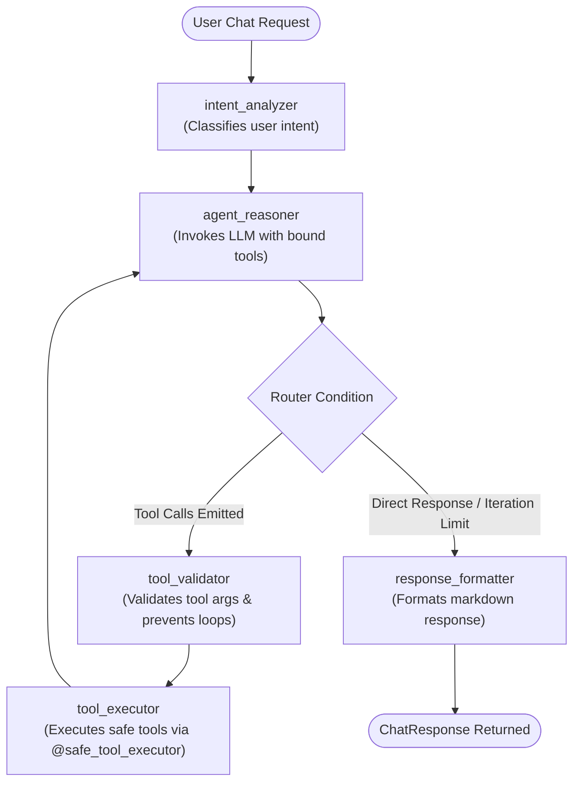

# StockPilot AI — LangGraph Agent Workflow & Orchestration

## 1. Overview

StockPilot AI implements a deterministic, multi-turn AI Agent powered by **LangGraph** and **Groq LLM** (`llama-3.3-70b-versatile`). Unlike unconstrained ReAct loops, StockPilot AI enforces structured intent detection, tool validation, loop detection guardrails, and strict separation between read queries and financial proposals.

---

## 2. LangGraph StateGraph Architecture



---

## 3. Agent State Schema (`AgentState`)

```python
class AgentState(TypedDict):
    # Chat message history (accumulated via add_messages reducer)
    messages: Annotated[Sequence[BaseMessage], add_messages]

    # Session Identifiers
    thread_id: str
    user_id: Optional[str]

    # Reasoning & Extracted Intent
    current_intent: Optional[str]
    retrieved_data: Dict[str, Any]
    proposed_actions: List[Dict[str, Any]]
    executed_tools: List[Dict[str, Any]]
    validation_errors: List[str]

    # State Machine Lifecycle & Guards
    workflow_status: str  # 'IN_PROGRESS', 'COMPLETED', 'WAITING_INPUT', 'FAILED'
    iteration_count: int  # Bounded to MAX_ITERATIONS = 5
    final_response: Optional[str]
```

---

## 4. Graph Nodes & Responsibilities

### 4.1 `intent_analyzer`
- Inspects the user's initial prompt and assigns a normalized category:
  - `INVENTORY_LOOKUP`: Checking product stock, locations, or shortages.
  - `SUPPLIER_INQUIRY`: Checking vendor pricing, MOQ, lead times.
  - `PROCUREMENT_ACTION`: Generating replenishment proposals.
  - `UNCERTAIN` / `OUT_OF_DOMAIN`: Vague or out-of-scope requests.

### 4.2 `agent_reasoner`
- Binds the 7 registered tools to the Groq LLM client.
- Evaluates conversation context, tool outputs, and user requests to determine the next action.
- Increments `iteration_count`. If `iteration_count >= 5`, triggers automatic transition to `response_formatter` to prevent runaway loops.

### 4.3 `tool_validator`
- Inspects LLM-generated tool calls against Pydantic schemas.
- Detects repeated identical tool calls with identical arguments to prevent circular reasoning.
- Sanitizes and validates arguments (e.g., non-negative quantities, valid categories).

### 4.4 `tool_executor`
- Dispatches tool invocations through `@safe_tool_executor`.
- Enforces timeout limits (`asyncio.wait_for`).
- Executes bounded exponential backoff retries on safe read queries encountering database blips.
- Appends typed `ToolMessage` payloads back into `AgentState`.

### 4.5 `response_formatter`
- Formulates a clean, grounded markdown summary.
- Incorporates structured purchase request summaries (Request Number, Total Estimated Cost, Priority, Next Steps).
- Sets `workflow_status = "COMPLETED"`.

---

## 5. Tool Catalog & Safety Matrix

| Tool Name | Operation Type | Safety Level | Timeout | Retry Policy | Description |
| :--- | :---: | :---: | :---: | :---: | :--- |
| `search_products` | Read | Safe | 8.0s | Max 2 retries (0.2s base) | Catalog search by SKU/name/category |
| `get_inventory` | Read | Safe | 8.0s | Max 2 retries (0.2s base) | Stock levels, status, & warehouse aisle locations |
| `find_low_stock_products` | Read | Safe | 8.0s | Max 2 retries (0.2s base) | Shortage scanning against reorder points |
| `get_supplier_options` | Read | Safe | 8.0s | Max 2 retries (0.2s base) | Wholesale pricing, MOQs, lead times, ratings |
| `calculate_reorder_recommendation` | Read / Math | Safe | 8.0s | Max 1 retry (0.2s base) | Suggested replenishment sizing & cost calculation |
| `get_purchase_request_status` | Read | Safe | 8.0s | Max 2 retries (0.2s base) | Status & line items lookup for purchase requests |
| `create_draft_purchase_request` | Mutating (Draft) | Controlled | 10.0s | **0 retries** | Creates draft purchase request. **Status strictly DRAFT.** |

---

## 6. Human-in-the-Loop Approval Workflow

When a user asks the AI agent to prepare replenishment for low-stock items:
1. Agent invokes `calculate_reorder_recommendation` to compute required units respecting supplier MOQ.
2. Agent invokes `create_draft_purchase_request` to register a proposal in `DRAFT` status.
3. Agent outputs a structured proposal summary and instructs the user to review the proposal on the `/approvals` dashboard.
4. **Execution Gate:** The AI Agent is structurally barred from approving proposals or calling `/approve`. Only authenticated managers (`UserRole.MANAGER` / `ADMIN`) can click "Approve" on the frontend to convert the draft into an official Purchase Order.
