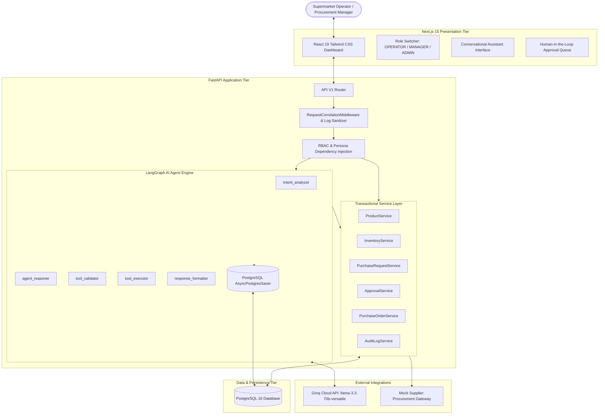
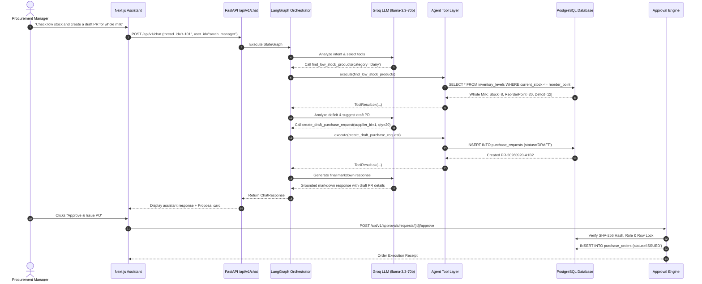

# StockPilot AI — System Architecture & Design Document

## 1. Executive Overview

**StockPilot AI** is an enterprise-grade autonomous inventory management and procurement copilot designed for supermarket retail chains. It combines conversational Large Language Model (LLM) reasoning with transactional database operations, enforcing deterministic business logic, strict security guardrails, and Human-in-the-Loop (HITL) approval gates before executing financial commitments.

---

## 2. High-Level System Architecture

The system is structured as a decoupled 3-tier architecture:

---

## 3. Core Architectural Subsystems

### 3.1 Presentation Tier (Next.js 15)
- **Framework:** Next.js 15 (App Router), React 19, TypeScript, Tailwind CSS, Lucide Icons.
- **Pages:**
  - `/` (Dashboard): Real-time KPI cards (Total SKUs, Low Stock, Pending Approvals, Total Value) and recent procurement activity.
  - `/inventory`: Paginated, searchable product inventory table with stock status badges and quick reorder calculator.
  - `/assistant`: Interactive chat copilot with real-time tool execution tracking and draft purchase proposal cards.
  - `/approvals`: Manager queue with cryptographic SHA-256 proposal hash verification and single-click Approve / Reject actions.
  - `/audit`: Immutable security and operation audit trail ledger.
- **Client Features:** User persona switching (`MANAGER`, `OPERATOR`, `ADMIN`) injecting simulated authenticated `X-User-Id` headers.

### 3.2 Application & Agent Tier (FastAPI + LangGraph)
- **Framework:** FastAPI, Pydantic V2, LangGraph, LangChain Core.
- **Agent Workflow:** Cyclical StateGraph with bounded iterations (max 5 iterations), preventing infinite loops.
- **Checkpointing:** State persistence via `AsyncPostgresSaver` associating state with unique `thread_id` sessions.
- **Reliability Wrapper:** `@safe_tool_executor` providing timeout protection (`asyncio.wait_for`), bounded retries for read queries, and exception trapping.

### 3.3 Data Tier (PostgreSQL 16)
- **ORM & Migrations:** SQLAlchemy 2.0 (Async Engine + asyncpg), Alembic migrations.
- **Integrity Constraints:** Database-level `CHECK` constraints on stock quantities, non-negative unit costs, ratings, and unique SKU/Supplier codes.
- **Audit Logging:** Append-only ledger recording every user and AI state transition with actor IDs, IP addresses, and state diff payloads.

---

## 4. End-to-End Data & Execution Flow

