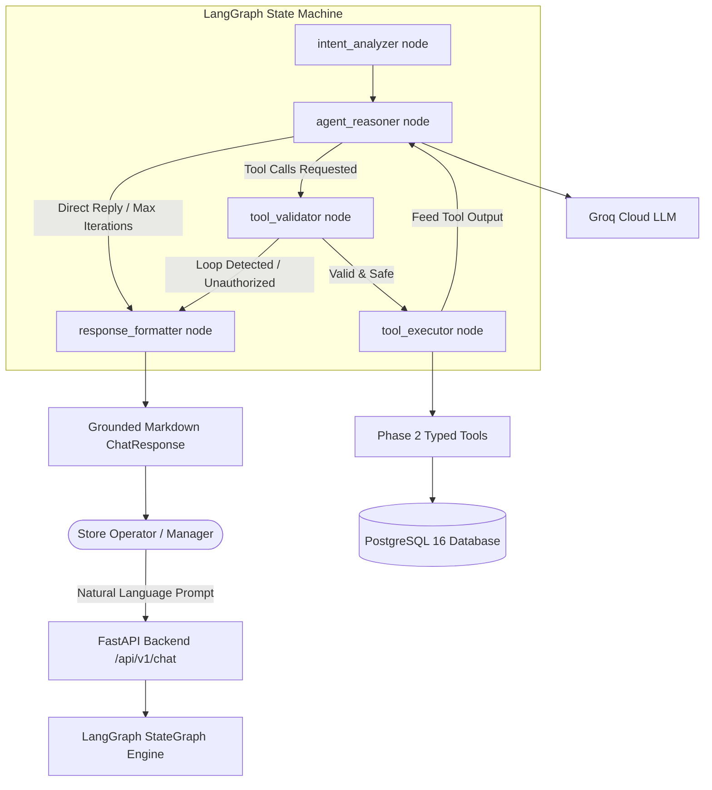
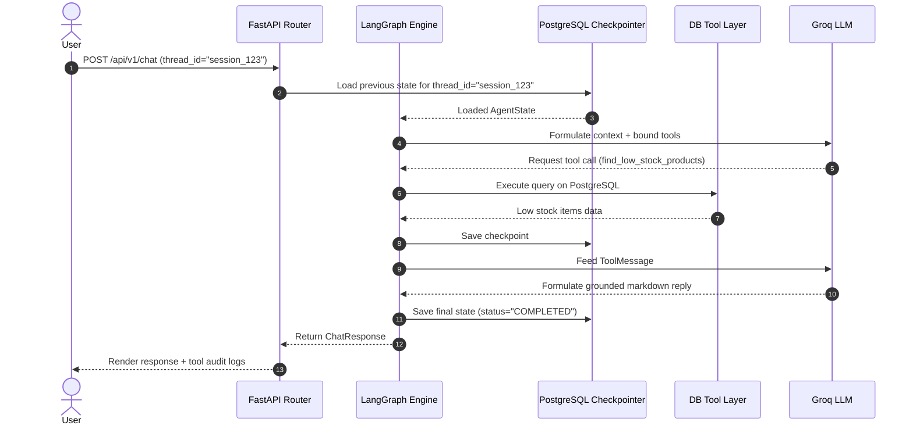

# StockPilot AI — System Architecture & Design Document

## 1. Executive Overview
**StockPilot AI** is an AI-powered inventory and procurement workflow automation platform. It is designed to interpret natural language inventory queries, analyze stock levels against reorder thresholds, generate draft purchase order proposals, request Human-in-the-Loop (HITL) approval, and safely execute transactions via audited tool calls.

---

## 2. Realistic MVP Scope

### In-Scope for MVP
1. **Natural Language Interface & Intent Parser:**
   - Query stock levels, low-stock warnings, and supplier details via conversational UI.
   - Request automated inventory audits and replenishment proposal generation.
2. **Deterministic Data Query & Reorder Analysis:**
   - Automated detection of products where `current_stock <= reorder_point`.
   - Dynamic calculation of suggested order quantities based on `reorder_quantity` or `(max_stock - current_stock)` while strictly respecting supplier Minimum Order Quantities (MOQ).
3. **Structured Purchase Proposal Generation:**
   - Multi-supplier identification (matching supplier catalog with low-stock SKUs).
   - Structured Draft Purchase Orders (POs) created with explicit status `DRAFT_PENDING_APPROVAL`.
4. **LangGraph State Machine & Checkpoint Persistence:**
   - Cyclical graph orchestration with explicit state schema (`AgentState`), intent detection, tool validation, and PostgreSQL durable checkpointing.
5. **Safe Tool Execution & Audit Trails:**
   - Read-only tools for analytics & querying.
   - Write/Transactional tools gated strictly behind approved tokens/states.
   - Complete ledger/audit log of agent thoughts, tool inputs, outputs, and user approvals.
6. **Configurable LLM Provider Adapter:**
   - Support for Groq Cloud API (`openai/gpt-oss-120b`, `llama-3.3-70b-versatile`) and Ollama local development.

---

## 3. High-Level System Architecture



---

## 4. LangGraph State Schema (`AgentState`)

```python
class AgentState(TypedDict):
    # Conversation Messages (Appended via LangGraph add_messages reducer)
    messages: Annotated[Sequence[BaseMessage], add_messages]

    # Session Identifiers
    thread_id: str
    user_id: Optional[str]

    # Workflow Reasoning & Extracted Intent
    current_intent: Optional[str]  # e.g. LOW_STOCK_AUDIT, SUPPLIER_INQUIRY, DRAFT_PURCHASE_REQUEST
    retrieved_data: Dict[str, Any]
    proposed_actions: List[Dict[str, Any]]
    executed_tools: List[Dict[str, Any]]
    validation_errors: List[str]

    # Lifecycle & Loop Guard
    workflow_status: str  # IN_PROGRESS, COMPLETED, WAITING_INPUT, FAILED
    iteration_count: int
    final_response: Optional[str]
```

---

## 5. Checkpointing & Multi-Turn Persistence

LangGraph utilizes durable checkpointing via PostgreSQL (`AsyncPostgresSaver` backed by connection pooling).

* **Session Association:** Every user conversation is assigned a unique `thread_id` passed in `config = {"configurable": {"thread_id": thread_id}}`.
* **State Recovery:** If an agent interaction spans multiple turns or requires resumption after human review, LangGraph loads the exact previous checkpoint from the `checkpoints` table.



---

## 6. Segregated Tool Boundaries

| Tool Name | Type | Safety Level | Description |
|---|---|---|---|
| `search_products` | Read-only | Safe / Auto | Searches product catalog by name/SKU/category. |
| `get_inventory` | Read-only | Safe / Auto | Queries stock levels, storage aisles, and stock status. |
| `find_low_stock_products` | Read-only | Safe / Auto | Extracts all SKUs at or below reorder threshold with shortages. |
| `get_supplier_options` | Read-only | Safe / Auto | Look up supplier pricing, ratings, lead times, and MOQs. |
| `calculate_reorder_recommendation` | Analytical | Safe / Auto | Computes suggested order sizes with supplier MOQ constraints. |
| `create_draft_purchase_request` | Safe Mutation | Safe (Draft only) | Creates draft purchase request. **Does NOT issue purchase orders.** |
| `get_purchase_request_status` | Read-only | Safe / Auto | Checks status and line items of a purchase request. |

---

## 7. Database Entity Schema

```
+----------------+          +-----------------------+          +----------------+
|    Supplier    | 1      * |   SupplierProduct     | *      1 |    Product     |
+----------------+----------+-----------------------+----------+----------------+
| id (PK)        |          | id (PK)               |          | id (PK)        |
| name           |          | supplier_id (FK)      |          | sku (Unique)   |
| email          |          | product_id (FK)       |          | name           |
| lead_time_days |          | unit_cost             |          | current_stock  |
| rating         |          | min_order_qty         |          | reorder_point  |
+----------------+          +-----------------------+          | max_stock      |
                                                               | unit_price     |
                                                               +-------+--------+
                                                                       | 1
                                                                       |
                                                                       | *
+----------------+ 1      * +-----------------------+ *      1 +-------v--------+
| PurchaseOrder  +----------+   PurchaseOrderItem   +----------+                |
+----------------+          +-----------------------+          +----------------+
| id (PK)        |          | id (PK)               |
| order_number   |          | purchase_order_id(FK) |
| supplier_id(FK)|          | product_id (FK)       |
| status         |          | quantity              |
| total_amount   |          | unit_cost             |
| created_by     |          +-----------------------+
| approved_by    |
| created_at     |
+-------+--------+
```
