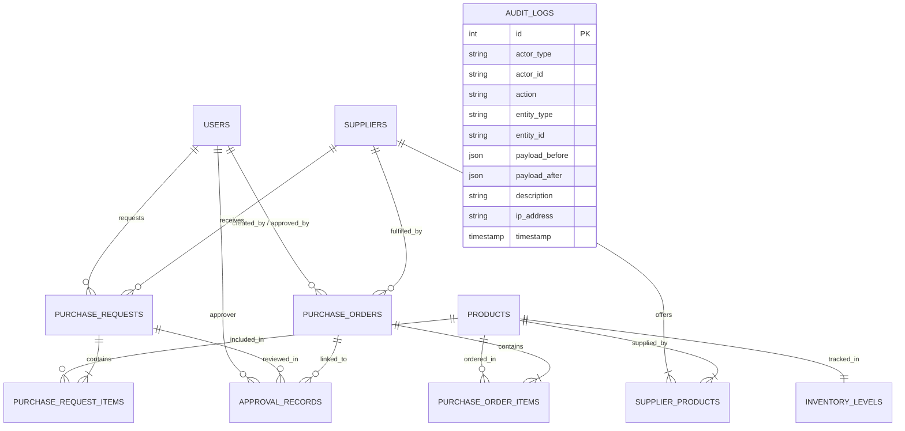

# StockPilot AI — Database Schema & Data Dictionary

## 1. Entity-Relationship (ER) Diagram



---

## 2. Table Specifications & Data Dictionary

### 2.1 `users`
Stores system actors and authentication/role profiles.
| Column | Type | Constraints | Description |
| :--- | :--- | :--- | :--- |
| `id` | `INTEGER` | `PRIMARY KEY AUTOINCREMENT` | Unique user ID |
| `email` | `VARCHAR(255)` | `UNIQUE, NOT NULL` | User email address |
| `username` | `VARCHAR(100)` | `UNIQUE, NOT NULL` | System login name |
| `full_name` | `VARCHAR(150)` | `NOT NULL` | Full display name |
| `hashed_password`| `VARCHAR(255)` | `NOT NULL` | Hashed password |
| `role` | `VARCHAR(50)` | `NOT NULL, DEFAULT 'OPERATOR'` | Enum: `ADMIN`, `MANAGER`, `OPERATOR` |
| `is_active` | `BOOLEAN` | `NOT NULL, DEFAULT TRUE` | Active account status |
| `created_at` | `TIMESTAMP WITH TZ` | `NOT NULL, DEFAULT UTC_NOW` | Record creation timestamp |
| `updated_at` | `TIMESTAMP WITH TZ` | `NOT NULL, DEFAULT UTC_NOW` | Last record update timestamp |

### 2.2 `suppliers`
Wholesale vendors supplying supermarket stock.
| Column | Type | Constraints | Description |
| :--- | :--- | :--- | :--- |
| `id` | `INTEGER` | `PRIMARY KEY AUTOINCREMENT` | Unique supplier ID |
| `code` | `VARCHAR(50)` | `UNIQUE, NOT NULL, INDEX` | Human-readable code (e.g. `SUP-DAIRY-01`) |
| `name` | `VARCHAR(200)` | `NOT NULL, INDEX` | Company/vendor business name |
| `contact_person`| `VARCHAR(150)` | `NULLABLE` | Lead representative name |
| `email` | `VARCHAR(255)` | `NOT NULL` | Order submission email |
| `phone` | `VARCHAR(50)` | `NULLABLE` | Contact phone number |
| `address` | `TEXT` | `NULLABLE` | Physical/warehouse address |
| `lead_time_days`| `INTEGER` | `NOT NULL, CHECK (>= 0)` | Expected shipping lead time in days |
| `rating` | `NUMERIC(3, 2)` | `NOT NULL, CHECK (>= 1.00 AND <= 5.00)`| Reliability rating (1.00 - 5.00) |
| `is_active` | `BOOLEAN` | `NOT NULL, DEFAULT TRUE` | Vendor active status |

### 2.3 `products`
Supermarket retail product master catalog.
| Column | Type | Constraints | Description |
| :--- | :--- | :--- | :--- |
| `id` | `INTEGER` | `PRIMARY KEY AUTOINCREMENT` | Unique product ID |
| `sku` | `VARCHAR(100)` | `UNIQUE, NOT NULL, INDEX` | Stock Keeping Unit (e.g. `SKU-MILK-001`) |
| `name` | `VARCHAR(255)` | `NOT NULL, INDEX` | Product title |
| `description` | `TEXT` | `NULLABLE` | Product details and packaging |
| `category` | `VARCHAR(100)` | `NOT NULL, INDEX` | Category (e.g. `Dairy`, `Produce`, `Beverages`) |
| `unit` | `VARCHAR(50)` | `NOT NULL` | Measurement unit (`gallon`, `pack`, `lb`, etc.) |
| `unit_price` | `NUMERIC(10, 2)`| `NOT NULL, CHECK (>= 0)` | Retail shelf price |
| `is_active` | `BOOLEAN` | `NOT NULL, DEFAULT TRUE` | Active catalog status |

### 2.4 `inventory_levels`
Real-time on-hand stock and warehouse storage locations.
| Column | Type | Constraints | Description |
| :--- | :--- | :--- | :--- |
| `id` | `INTEGER` | `PRIMARY KEY AUTOINCREMENT` | Unique inventory record ID |
| `product_id` | `INTEGER` | `UNIQUE, NOT NULL, FK(products.id)` | Linked product record |
| `current_stock` | `INTEGER` | `NOT NULL, CHECK (>= 0)` | Total units on-hand in warehouse/store |
| `reserved_stock`| `INTEGER` | `NOT NULL, DEFAULT 0, CHECK (>= 0)`| Units allocated to active customer orders |
| `reorder_point` | `INTEGER` | `NOT NULL, CHECK (>= 0)` | Minimum threshold triggering replenishment |
| `reorder_quantity`| `INTEGER` | `NOT NULL, CHECK (>= 1)` | Standard replenishment batch size |
| `max_stock` | `INTEGER` | `NOT NULL, CHECK (>= reorder_point)`| Maximum physical shelf/bin capacity |
| `warehouse_location`| `VARCHAR(100)` | `NOT NULL` | Storage coordinates (e.g. `AISLE-01-A`) |
| `last_restocked_at`| `TIMESTAMP WITH TZ`| `NULLABLE` | Last replenishment date |

### 2.5 `supplier_products`
Many-to-many matrix linking suppliers to catalog items with wholesale pricing.
| Column | Type | Constraints | Description |
| :--- | :--- | :--- | :--- |
| `id` | `INTEGER` | `PRIMARY KEY AUTOINCREMENT` | Unique mapping ID |
| `supplier_id` | `INTEGER` | `NOT NULL, FK(suppliers.id)` | Linked supplier |
| `product_id` | `INTEGER` | `NOT NULL, FK(products.id)` | Linked product |
| `supplier_sku` | `VARCHAR(100)` | `NULLABLE` | Vendor catalog part number |
| `unit_cost` | `NUMERIC(10, 2)`| `NOT NULL, CHECK (>= 0)` | Contract wholesale price per unit |
| `min_order_qty` | `INTEGER` | `NOT NULL, DEFAULT 1, CHECK (>= 1)` | Minimum Order Quantity (MOQ) |
| `lead_time_days`| `INTEGER` | `NOT NULL, CHECK (>= 0)` | Specific lead time for this SKU |
| `is_preferred` | `BOOLEAN` | `NOT NULL, DEFAULT FALSE` | Flag for preferred primary supplier |

### 2.6 `purchase_requests` & `purchase_request_items`
Draft purchase proposals awaiting Human-in-the-Loop manager approval.
- **Statuses (`PurchaseRequestStatus`):** `DRAFT`, `PENDING_APPROVAL`, `APPROVED`, `REJECTED`, `CONVERTED_TO_PO`, `EXPIRED`, `CANCELLED`.
- **Priority Levels (`PriorityLevel`):** `LOW`, `MEDIUM`, `HIGH`, `CRITICAL`.

### 2.7 `purchase_orders` & `purchase_order_items`
Executed legal purchase orders dispatched to suppliers.
- **Statuses (`PurchaseOrderStatus`):** `DRAFT`, `PENDING`, `ISSUED`, `CONFIRMED`, `PARTIALLY_RECEIVED`, `RECEIVED`, `CANCELLED`.

### 2.8 `approval_records`
Historical approval decisions signed by managers with comments and timestamps.
- **Decisions (`ApprovalDecision`):** `APPROVED`, `REJECTED`, `REVISED`.

### 2.9 `audit_logs`
Immutable compliance and security trail for all AI agent and human actions.
- **Actor Types (`ActorType`):** `USER`, `AI_AGENT`, `SYSTEM`.

---

## 3. Database Migration Procedures

Migrations are managed through Alembic.

1. **Apply all pending migrations:**
   ```bash
   alembic upgrade head
   ```

2. **Generate a new migration:**
   ```bash
   alembic revision --autogenerate -m "add_new_fields"
   ```

3. **Rollback last migration:**
   ```bash
   alembic downgrade -1
   ```

4. **Reset Database & Reseed:**
   ```bash
   python scripts/reset_db.py
   ```
